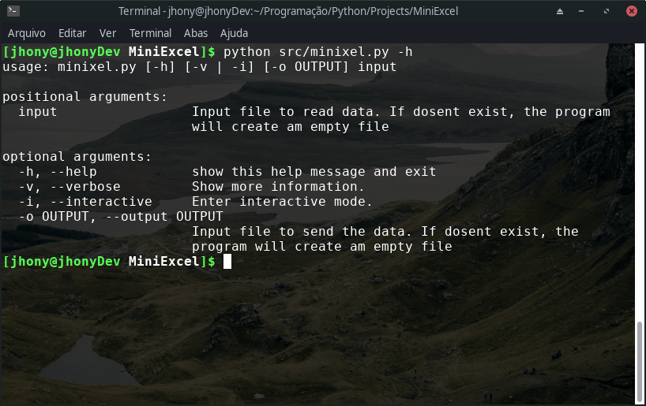

# Miniexcel core

This project was inspired by this [video](https://www.youtube.com/watch?v=HCAgvKQDJng), and the challange is to write an Excel engine, which receives an input file (csv) with formulas and is able to compute them and output to another file or print on screen.

# Usage

Simple as shown in the picture... The `-v` cannot be used with the `-i`: These are display modes, where the verbose mode displays the output to the screen using ASCII codes for formatting, and the interactive mode (not implemented yet) use curses to interactively display and modify output in the terminal.

The input has to be an .csv file with comma (`,`) as column separator and breaklines (`\n`) as row separator. Each cell can be text, number (non float) or Formulas.

Every **Formula** starts with `=` and can be anything like that bellow:

- **Cell links**: `=A1`, `=B1`
- **Aritmetic operations**: sum(`+`), subtraction(`-`), multiplication(`*`), division(`/`) and pow(`^`), where the frist ones (sum, subtraction) has lower precedence.
- **Brackets**: You can always overcome the arithimecic operations with brackets `=(A1+B1)*5`
- **Literals**: Add hole numbers to your formulas `=A1*5`
- **Interval computations**: Instead of referencing a bunch of cells at same col doing the same basic operations, you can use `SUM()`, `SUB()`, `DIV()` and `MUL()`, where the only arg needed is an cell interval `AI:E:S` (`I` becomes the initial position, `E` the ending included and `S` the step): `=SUM(A1:5)` is equal to `=A1+A2+A3+A4+A5`.
- **Filling non-defined cells with zeros**:If one row has 5 columns and the others has only 3 elements (that row has only 3 commas),these cells that're not defined will be filled with zeros when displayed. But, if the row has more commas, (like `1,2,3,,`), that cells will be not replaced and will be treat as empty strings. So if you want automaticly fill the cells gaps with zeros dont worrie about commas, just leave them as they are.

## Bypassing some issues:

- **Lack of support of float numbers**: The Miniexcel Core dosen't support floating points passed as literals on cells and formulas (they are convert to strings or throws error when inside a formula). But, you can use the power of Formulas to treat this out, because they are computed: `=1/2` can be used and will be saved as `=0.5`.
- **Square root of numbers**: Whell, you can use the fact as $x^{a/b} = \sqrt[b] {x^a}$ using the Formulas: `=8^(1/3)` will be `=2.0`, because $8^{1 \div 3} = \sqrt[3] {8^1}$.

# Todos:

- [ ] Support more than 26 columns by repeating cell label.
- [ ] Implement the interactive mode.
- [ ] Add suport for IF and IF..ELSE statments.
- [ ] Add string concat operation with `+`.